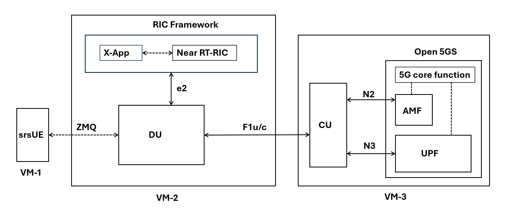

## 01. Basic Architecture

Referring resources I followed, \
https://docs.srsran.com/projects/project/en/latest/index.html and 
https://github.com/srsran/srsran_project

  <ins>Components:</ins> 
  
  **5GC:** Open5GS.
  
  **NearRT-RIC:** ORAN SC platform with xApp integration.
  
  **CU/DU Split:** srsRAN or combined with OpenAirInterface.
  
  **srsUE:** [srsRAN 4G](https://github.com/srsran/srsRAN_4G) does include a prototype 5G UE (srsUE) which can be used for testing.

 We'll be demonstrating ZMQ based virtual radio setup.
